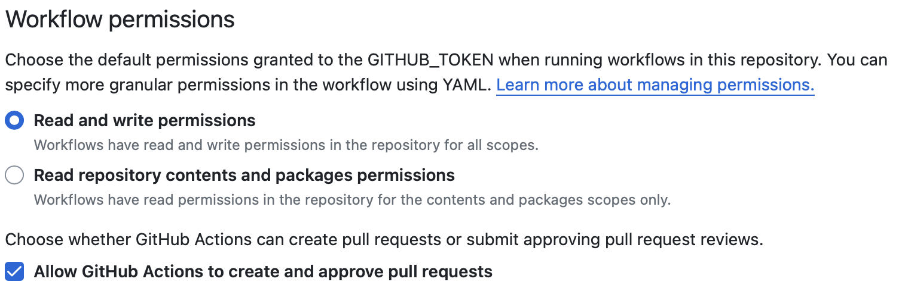
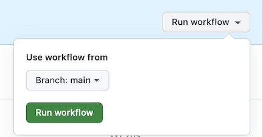

# training-specific-template

This repository is intended to serve as a template for creating a repository for an individual Data Lab workshop.
The repository structure and use of GitHub Pages is intended to gather all material required to administer a workshop in one user-friendly place.
We use a template repository approach for maintainability.

Please refer to [`CONTENTS.md`](./CONTENTS.md) for a brief overview of this repository's contents.

## Creating a repository for an individual training workshop

First, you will need to create a new repository using the [`Use the template` button](https://help.github.com/en/github/creating-cloning-and-archiving-repositories/creating-a-repository-from-a-template).
This will create a new repository with the same layout as this template repository under the user or organization you choose as the owner of the repository; if you are a Data Lab member running an internal training workshop, the `AlexsLemonade` organization should be the owner.

### Turning on required settings


1. Ensure you have the correct [visibility setting](https://docs.github.com/en/repositories/managing-your-repositorys-settings-and-features/managing-repository-settings/setting-repository-visibility) for your GitHub account tier.
    * If you are using GitHub from a **paid account tier** (e.g., GitHub Pro, GitHub Team, or GitHub Enterprise), you can set the visibility of this repository as either public or private; the associated GitHub Pages website will still be public.
    * If you are using GitHub from a **free account tier** (e.g., GitHub Free for individuals or organizations), you must set the visibility of this repository as **public** for [GitHub Pages to be active](https://docs.github.com/en/pages/getting-started-with-github-pages/about-github-pages).

2. Turn on workflow permissions for GitHub Actions.
    * There are several [manually-triggered GitHub Actions](https://docs.github.com/en/actions/using-workflows/manually-running-a-workflow) provided to facilitate setting up this new repository.
    * You must turn on "Read and Write" permissions for GitHub Actions to use them:
      * Navigate to the repository's "Settings" tab at the top of the page.
      <br><br>

      * Navigate to the `Actions` -> `General` page from the sidebar
      <br><br>

      * Ensure [the following settings](https://docs.github.com/en/repositories/managing-your-repositorys-settings-and-features/enabling-features-for-your-repository/managing-github-actions-settings-for-a-repository#configuring-the-default-github_token-permissions) are turned on:
        <br>
        


## Customizing the new repository for an individual training workshop

The first step of setting up up this repository is to run the [manually-triggered GitHub Action](https://docs.github.com/en/actions/using-workflows/manually-running-a-workflow) "Manually trigger issue creation for standard set up" GitHub action.
When triggered, this action will file a series of issues comprising tasks that should be completed before the start of a workshop.

Run this action as follows:

* Navigate to the repository's "Actions" tab at the top of the page.
<br><br>

* On the upper left-hand side, you will see all available workflows.
* Click the workflow named `Manually trigger issue creation for standard set up`, and then click the "Run workflow" dropdown button.
  * You will see a dropdown button "Use workflow from"; ensure this says the default branch `main`: 

To complete repository setup, address all issues filed by this workflow.

## Local development

It can be helpful to build the GitHub Pages site locally to check that passing parameter values is working as expected.

### Running in a pixi environment

While previously installing and setting up Ruby and Jekyll somewhat manually was required, you can now use the `pixi` tool to create a reproducible environment for building and testing the site locally.

Assuming you have `pixi` installed, you can use a pre-configured tasks to install dependencies and serve the site:

For setting up ruby dependencies, run

```
pixi run setup
```

Then, to serve the site, run

```
pixi run serve
```

This will start a local web server at `http://localhost:4000`.
