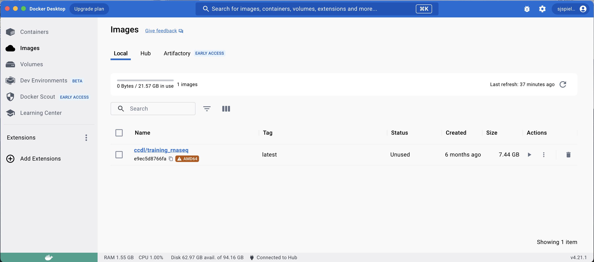
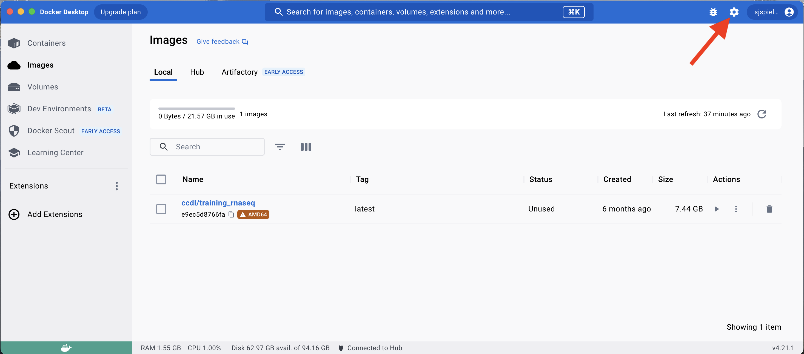
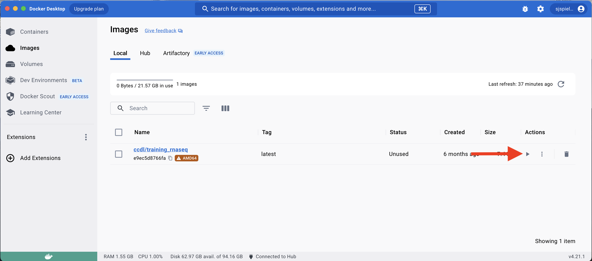
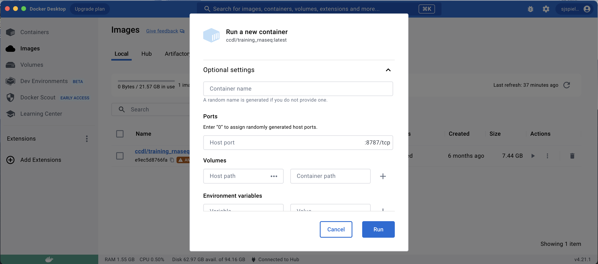
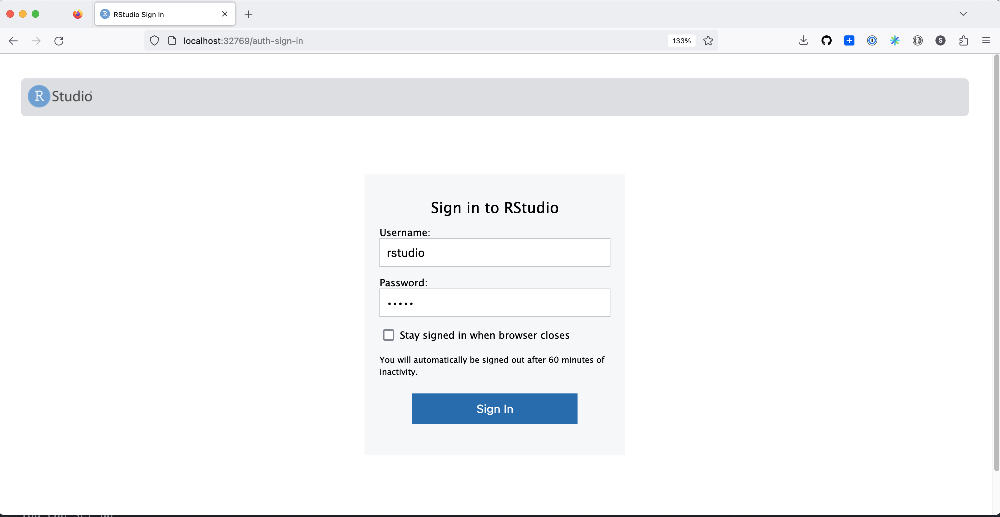
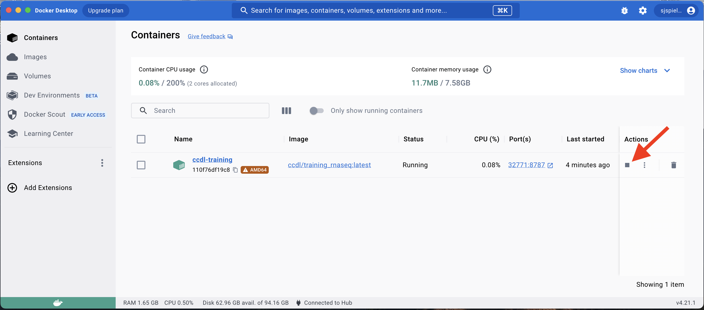

## Background

You will continue to have access to RStudio Server and the files in your home directory for 6 months following this workshop.
We recognize there may be circumstances where you will need to process files locally.
Running the same software that we use for training on your local computer can be challenging, particularly for Windows users.
(For example, some command-line tools we use during our training modules, like `salmon`, are not supported on Windows.)

On this page, we'll introduce **two different approaches** you can use to access the same computing environment we used in the workshop:

The first strategy uses [**Docker**](https://docs.docker.com/get-started/overview/), a software that allows us to package a computing environment such that it can be fully reproduced between different computers and operating systems; it is sometimes referred to as a "lightweight virtual machine."
We have put together a **Docker image** that fully replicates the computing environment, including all software dependencies (both R packages and command-line tools) we use during the workshop on the RStudio Server.

The second strategy uses [**`renv`**](https://rstudio.github.io/renv/articles/renv.html), an R package for managing R package versions.
Using `renv` will provide you with R packages at the same versions used in the workshop, but unlike Docker, it will _not_ provide command-line tools (e.g., `salmon`) or an RStudio Server to access via browser.

## Using Docker post-workshop

- You can find instructions for installing Docker Desktop on your operating system in the Docker documentation at this link: <https://docs.docker.com/get-docker/>.
- You can find full documentation for using Docker Desktop at this link: <https://docs.docker.com/desktop/use-desktop/>.

### Obtain the Docker image

Once you've installed Docker Desktop, you will need to pull the appropriate image using the command line:

- On *macOS*, search for and open `Terminal`.
- On *Windows*, search for and open `Command Prompt`.

In your respective command line interface, copy and paste the following:

```
docker pull {{site.docker_user}}/{{site.docker_repo}}:{{site.docker_tag}}
```
This command will download the docker image from the training workshop.
Once this has completed, you will see this new image in the _Images tab_ of Docker Desktop:



 From this downloaded image, you can launch a _container_ using this image to fully replicate the workshop environment in a RStudio Server session in your browser.

### Modify Docker resources

Because this RStudio Server is running on your computer (not a remote server), it will only have the resources (RAM and CPU) that you provide it.
You can [set up resource limits](https://docs.docker.com/config/containers/resource_constraints/) by clicking the gear icon in Docker Desktop to access the Settings menu.




From here, navigate to the _Resources_ tab and select the number of CPUs and amount of RAM you would like your container to have access to.
In this example, we have selected 2 CPUs and 8 GB RAM, as well as 2 GB swap memory (amount of memory that Docker can "swap" in to avoid running out of memory).


Once you have made your selection, click **Apply & restart**.

### Set up local files

Docker only has access to folders that you explicitly specify when launching an image, so you need to make sure everything you will need is in one place.
You can then tell Docker to include this folder in your running container.

⚠️ It is important to be aware that any files that you save to the Docker container _outside of this specified folder_ are ephemeral - once you destroy the container, those files will disappear!
Therefore, it's very important to save files in your specified folder when working in your Docker container so that files continue to exist on your computer.

> Tip! If you would like to work with the actual workshop materials, you should download the `training-modules` folder from the Data Lab's RStudio Server and then tell Docker to include that folder in your container; [this page](../workshop/working-with-your-own-data.md) explains how to transfer files to and from the server.


### Create the Docker container

Now, you are ready to launch a container using the workshop's Docker image.
These instructions explain how to set that container up to run it for the first time.
For all future uses, you can skip these steps and simply run the container you have created here.

In the Docker _Images_ tab, you should see that you now have an image called `ccdl/training_rnaseq` which you pulled from the command line.
To create a container from this image, click the Run icon:




You will then see a dropdown menu of **Optional settings** for this new container; click this menu to reveal these options.





Now, set the following:

* **Container name**
  * You can choose any name you would like here, or let Docker pick a fun random name for you!
  * Going forward, this container name will be shown in the "Containers" Docker Desktop tab, and you can always re-launch the container from there.
* **Ports**
  * This setting controls how the RStudio Server is launched in your browser.
  Enter a `0` in this field to randomly assign a port.
* **Volumes**
  * This is where you tell Docker which local folder you want to have access to when working in the container.
  * First, provide the **Host path**, which is the local folder on your computer.
  Click the three dots select folder you want to include in the container.
  * Second, provide the **Container path**, which is where in the Docker container this local folder should appear.
    * You will want this to be located within `/home/rstudio` directory to make it easy to find, so enter something like `/home/rstudio/<my_folder>` for this path (where `<my_folder>` is the name of the folder on your computer).
* **Environment variables**
  * There is one environment variable you need to specify: a password that will allow you to access the RStudio Server once its launched in browser.
  * Enter `PASSWORD` in the **Variable** field, and provide a memorable password in the **Value** field.


Finally, click the **Run** button at the bottom of this popup to launch a container with these settings.

Now you have created your container!
In the future you can skip these variable definition steps and run the container directly from the _Containers_ tab, as described next.


### Run the Docker Container

Navigate back to the _Containers_ tab in the Docker Desktop app.
You should see the container you just launched is running.
It will have the name you specified; in this example, the specified name was `ccdl-training`.


To launch the RStudio Server in this container, click the Port link which will launch the RStudio Server in your browser.


It will prompt you for login information: Your username is always `rstudio`, and your password is whatever you entered for the `PASSWORD` environment variable.




Upon logging in, the Files pane should contain the local folder you told Docker to include, so you're all ready to go!

To stop (but not delete!) the Docker container when you are finished for the day, come back to Docker Desktop and hit the **Stop** button for this container.




Once stopped, this icon will switch to a **Play** button which you can click to re-launch the container.


## Use renv post-workshop

Using `renv` will allow you to replicate the _`R` environment only_ used in the training workshop, but not other command-line tools.

This link provides full documentation for the `renv` package: <https://rstudio.github.io/renv/articles/renv.html>.


### Installing dependencies


#### R, RStudio, and renv

While not strictly required, we recommend that you install the same `R` version that we used during the workshop (version `4.2.3`).

> Protip: You might find the [`rig` software](https://github.com/r-lib/rig) useful for getting this specific `R` version!

You can download R and RStudio following [these instructions](https://posit.co/download/rstudio-desktop/).

You can then launch RStudio and install the `renv` package from CRAN: `install.packages("renv")`.


#### Command-line tools

You may need to install a few more things (if you have not previously installed them) so that the R packages `renv` installs can build properly.

* **Windows** users will need to install [`Rtools42` for Windows](https://cran.r-project.org/bin/windows/Rtools/rtools42/rtools.html); this will allow you to compile R packages.
  * `Rtools` is generally specific to a given R version, so if you have newly downloaded R, you will need to download the correct `Rtools` version for it as well.
* **macOS** users will need to install `Xcode` developer command line tools and a GNU `fortran` compiler (`gfortran`), as described [here](https://mac.r-project.org/tools/).
  * You can install command line tools by launching `Terminal` and entering
  ```
  xcode-select --install
  ```
  * You can install `gfortran` directly from [this link](https://mac.r-project.org/tools/gfortran-12.2-universal.pkg).

### Setting up renv

Once all dependencies are installed, launch RStudio and create a new RStudio Project, as described in [these instructions](https://support.posit.co/hc/en-us/articles/200526207-Using-RStudio-Projects).
We recommend that you create your project in a folder on your computer which contains all the materials you want to work with.

Next, you will need to download the `renv` **lockfile**, which records all R packages and their specific versions, used to set up the workshop you attended.
This lockfile is stored in our [`training-modules` repository](https://github.com/AlexsLemonade/training-modules/).

You can download the exact version of the lockfile used for your workshop by copy/pasting this command into the R Console.
_Make sure your RStudio Project has launched before you run this command so that this file is downloaded to the correct location on your computer!_

```
download.file(https://raw.githubusercontent.com/AlexsLemonade/training-modules/{{ site.release_tag }}/renv.lock)
```

Finally, it's time to set up `renv`!

Run the following command in R Console:

```
renv::init()
```

R will then prompt you if you want to proceed (enter `Y`), and then it will prompt the following:

```
This project already has a lockfile. What would you like to do?

1: Restore the project from the lockfile.
2: Discard the lockfile and re-initialize the project.
3: Activate the project without snapshotting or installing any packages.
4: Abort project initialization.
```

Enter `1` to restore the project from the existing lockfile.
At this point, all R packages should automatically install and your R environment will be all set up and ready to go!

⚠️ These installed packages can _only_ be accessed when working in this RStudio Project, so you will always need to work in this RStudio Project to replicate the workshop's R environment.
For more on how and why this is the case, check out the [full `renv` documentation](https://rstudio.github.io/renv/articles/renv.html.

## Parting thoughts and further reading

Working with Docker and/or `renv` can be tricky! If/when you run into trouble setting up environments after training, you can always use Cancer Data Science Slack to ask questions!

For further reading about these tools, we recommend these resources:

* [_Reproducibility of computational workflows is automated using continuous analysis_](https://doi.org/10.1038/nbt.3780) by Beaulieu-Jones & Greene (2017)
* [Digging into Data Science Tools: Docker](https://towardsdatascience.com/digging-into-data-science-tools-docker-bbb9f3579c87)
* [A short guide to using Docker for your data science environment](https://towardsdatascience.com/a-short-guide-to-using-docker-for-your-data-science-environment-912617b3603e)
* The `renv` [package website](https://rstudio.github.io/renv/)
* The full `renv` [user guide](https://docs.posit.co/ide/user/ide/guide/environments/r/renv.html)
