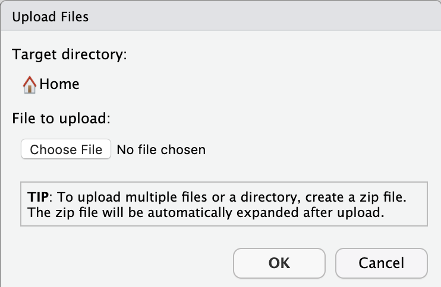
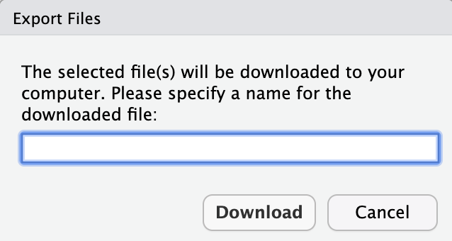
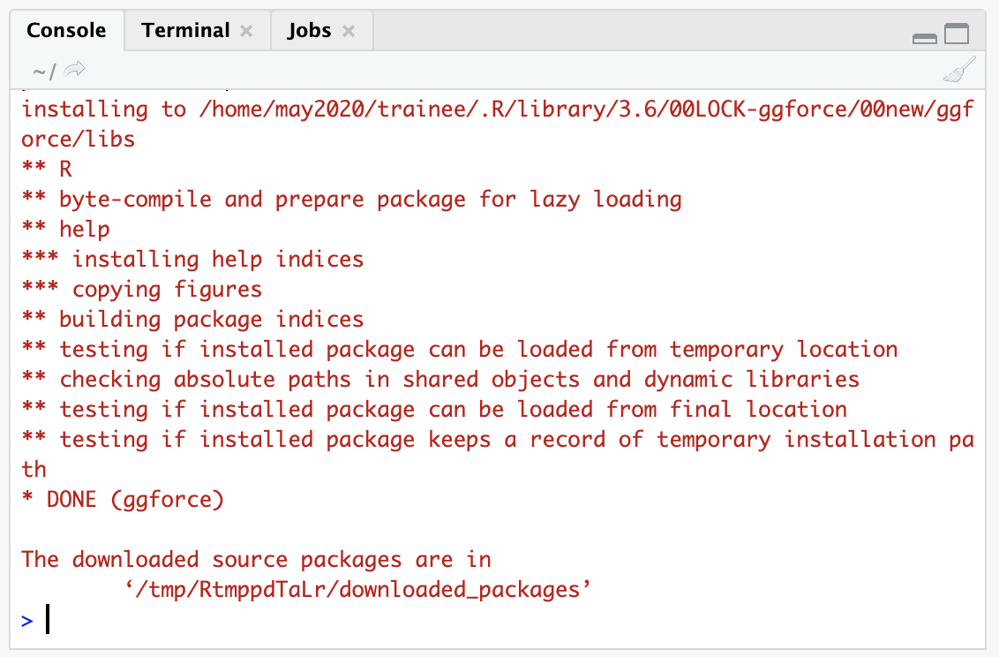

## Working with your own data

The goal of our workshop is to equip you to do initial analyses with your own data!
This guide will take you through how to get your data onto our RStudio server so you can begin analyzing your own data!

### Things to know before uploading your data

- If you are uploading data from human patient sequencing samples, **please be sure that you are doing so in a manner that is consistent with participant consent and your institution’s rules**. The only data that is permissible for upload to our server is that which has been summarized to non-sequence level and has no personally identifiable information (PII) and no protected health information (PHI).

- Initially, we have equipped you with **50 GB of space** (if the data you would like to upload is larger than this, please consult one of the CCDL team members through Slack for assistance).

- If you don't have your own data that you are looking to analyze, but would like real transcriptomic datasets to practice with, see the [Resources for Consultation Sessions page](../virtual-workshop/resources-for-consultation-sessions.md) and/or ask a CCDL team member for recommendations.

- Note that uploading datasets that are larger than 1GB may require splitting it up into smaller files. Contact a CCDL team member if you need help splitting up any large files!

- You will have access to our RStudio Server for 6 months.
We will email you with a reminder 6 months from now so you can make sure to remove any files from our RStudio Server that you may find useful before your access is revoked and the files are deleted.

- As always, please Slack one of the CCDL team members if you need help with anything (that is what we are here for!).

<!-- START doctoc generated TOC please keep comment here to allow auto update -->
<!-- DON'T EDIT THIS SECTION, INSTEAD RE-RUN doctoc TO UPDATE -->
**Table of Contents**  *generated with [DocToc](https://github.com/thlorenz/doctoc)*

  - [Things to know before uploading your data:](#things-to-know-before-uploading-your-data)
  - [Upload data that is online (from a url)](#upload-data-that-is-online-from-a-url)
  - [Upload data from your own computer](#upload-data-from-your-own-computer)
  - [Reading the data into your R environment.](#reading-the-data-into-your-r-environment)
- [Downloading files](#downloading-files)
- [Installing packages](#installing-packages)
  - [Finding what packages are installed](#finding-what-packages-are-installed)
  - [Installing a new package](#installing-a-new-package)
    - [install.packages()](#installpackages)
    - [Bioconductor packages](#bioconductor-packages)
  - [More resources on package installation strategies](#more-resources-on-package-installation-strategies)

<!-- END doctoc generated TOC please keep comment here to allow auto update -->

### Upload data that is online (from a url)

If you are retrieving your data from online, perhaps from a publicly available repository, we encourage you to use the terminal command `wget`.

**Step 1)** Go to the Terminal tab in your RStudio session.


**Step 2)** Copy over the [template script](./template-script/wget-TEMPLATE.sh).

You'll find the `wget` template script in the `template-script/` folder.
In the RStudio Server, you can click the check mark next to the file name, then go to `More` > and choose `Copy To`.

**Step 3)** Set up your `wget` command in the template script we started for you.

The most simple `wget` command just needs the URL to pull the file from.

*Template:*
```
wget <URL>
```

*Specific example:* Here's an example of us downloading a file from ArrayExpress
```
wget https://www.ebi.ac.uk/arrayexpress/files/E-GEOD-67851/E-GEOD-67851.processed.1.zip
```

By default, the file will be saved to the current directory and the file name it had from its origin (so with the above example `E-GEOD-67851.processed.1.zip`).

Likely you will want to be more specific about where you are saving the file to and what you are calling it.
For that, we can use the `-O`, or `output` option with our `wget` command and specify a file path.  

*Template:*
```
wget -O <FILE_PATH_TO_SAVE_TO> <URL>
```

*Specific example:* Here's an example where we will download that same array express file, but instead save it to the `data` folder and call it `some_array_data.zip`.
(Best to keep the file extension consistent to avoid troubles!)

```
wget -O data/some_array_data.zip https://www.ebi.ac.uk/arrayexpress/files/E-GEOD-67851/E-GEOD-67851.processed.1.zip
```

`-O` is one of many `wget` command options.
To see the complete list of `wget` options, use the command: `wget -h` in Terminal.

[See more `wget` examples](https://www.tecmint.com/10-wget-command-examples-in-linux/)

As is recommended and also shown with this example, this dataset is zipped.
This means after you successfully `wget` the file, you will need to unzip it.
To unzip the contents to a particular directory, we will use the `-d` option.

*Template*
```
unzip -d <DIRECTORY_TO_UNZIP_TO> <FILE_TO_UNZIP>
```

*Specific example:*
Here we will unzip the contents of data/some_array_data.zip to be saved to the directory `data/`.

```
unzip -d data/ data/some_array_data.zip
```

[Go here](https://itsfoss.com/unzip-linux/) for more on the unzipping command.

**If you have a password:**

You can `wget` data still if you need credentials.
We don't recommend you put your password or any other credentials in the script, so you will want to type the following directly into the Terminal:

```
wget --user=<USERNAME> --ask-password <URL>
```

Using the `--ask-password` will prompt you to enter your password. 

### Upload *small* files from your own computer

*This will only work for files smaller than 1GB*

If the data you want to use is stored locally on your computer, here's how we recommend uploading it to the RStudio Server.

**Step 1)** We recommend you compress your data folder into a single zip file.

For most operating systems, you can right-click on your data folder, and choose `Compress` to zip up your files
- [Windows zipping](https://support.microsoft.com/en-us/help/14200/windows-compress-uncompress-zip-files)
- [Mac zipping](https://www.imore.com/how-compress-file-your-mac)

For reference, here's how you [compress files from the command line](https://coolestguidesontheplanet.com/how-to-compress-and-uncompress-files-and-folders-in-os-x-lion-10-7-using-terminal/).

**Step 2)** Once your data is compressed to a single file, [navigate to your RStudio session](./rstudio-login.md).

**Step 3)** Use the `Upload button` to choose your compressed data folder.

This button is in the lower right panel of your RStudio session:


A mini screen will pop up asking you to choose the file you want to upload:



Choose your compressed data file, and click `OK`.
This may take some time, particularly if you have a large dataset.  

When the server is finished uploading your data, you should see your file in your `home` directory!
It will automatically be uncompressed.

### Reading the data into your R environment.

This step is very dependent on the format of your data and what you are planning to do with it!
If your file is a TSV, CSV, or RDS file, follow the examples in the `intro-to-R-tidyverse/intro-to-tidyverse.Rmd` notebook.

We do NOT recommend clicking on the file in the RStudio panel to load it into your R environment, this typically won't work for anything that's not a very small file.

Plus, for reproducibility purposes, you should write the data reading step into your notebook analyses!

## Downloading files

Any files on the RStudio server you would like to save to your computer you can export.

**Step 1)** Select the file(s) or folder(s) you would like to download
Check the box(es) to the left of the files or folder(s) in the **Files** pane.

**Step 2)** Use the Export button!

Click on the `More` button with a gear next to it in the lower right pane.


**Step 3)** Specify the name you would like the downloaded file to have.



**Step 4)** Find where the file downloaded.
Your computer may show the file in the bottom left of your browser window.
You are likely to find your files in your `Downloads` folder!

## Installing packages

As you are working with your own data, you may find you want functionality from a package not yet installed to the RStudio server.
Here, we'll take you through some basics of how to install new packages.

### Finding what packages are installed

The RStudio Server has a list of packages installed for you already.
You can see this list of installed R packages by looking in the `Packages` tab:


Or, by using the `installed.packages()` command in the `Console` tab.

Note that the checkmarks in the `Packages` tab indicate which packages are loaded currently in the environment.

### Installing a new package

Here we will take you through the most common R package installation steps and the most common roadblocks.
However, [*package dependencies*](http://r-pkgs.had.co.nz/description.html#dependencies), packages needing other packages to work (and specific versions of them!), can make this a [hairy process](https://en.wikipedia.org/wiki/Dependency_hell).
Because of this, we encourage you to reach out to one of the CCDL team members for assistance if you encounter problems beyond the scope of this brief introduction!

#### install.packages()

The Comprehensive R Archive Network or CRAN is a repository of packages that can all be installed with the `install.packages()` command.

In this example, we'll install `ggforce` which is a companion tool to `ggplot2` and is on CRAN.

We'll need to put quotes around `ggforce`!

```
install.packages("ggforce")
```

You should see output in the Console that shows some download bars, and finally some output that looks like this:



If your package installation is NOT successful, you'll see some sort of message like :

```
Warning in install.packages :
installation of package ‘ggforce’ had non-zero exit status
```

#### Bioconductor packages

Bioconductor has a collection of bioinformatics-relevant packages but requires different steps for installation.
These steps depend on `BiocManager` to be installed.

We have already installed `BiocManager` for you on the RStudio server, but on your computer you could install it by using `install.packages("BiocManager")` like we did in the previous section (Its on CRAN).

Since `BiocManager` is installed, (which you can check by using the [strategies in the above section](#finding-what-packages-are-installed)) then you can use the following command to install a package.
In this example, we'll install a package called `GenomicFeatures`.
```
BiocManager::install("GenomicFeatures")
```

You should get a similar successful installation message as in the previous section.  

Or if it failed to install, it will give you a `non-zero exit status` message.

### More resources on package installation strategies
- [Stack Overflow: Non-zero exit status](https://stackoverflow.com/questions/35666638/cant-access-user-library-in-r-non-zero-exit-status-warning)
- [Installing R packages](https://www.r-bloggers.com/installing-r-packages/)
- [Installing GitHub R Packages](https://cran.r-project.org/web/packages/githubinstall/vignettes/githubinstall.html)
