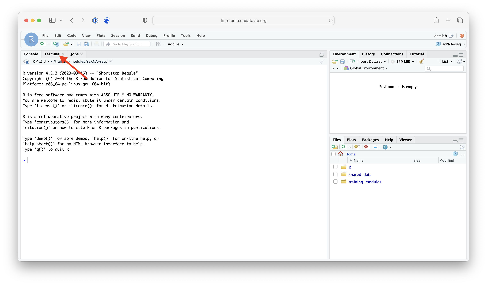
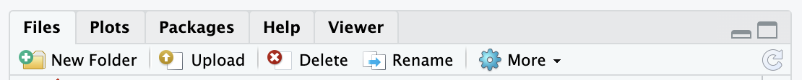
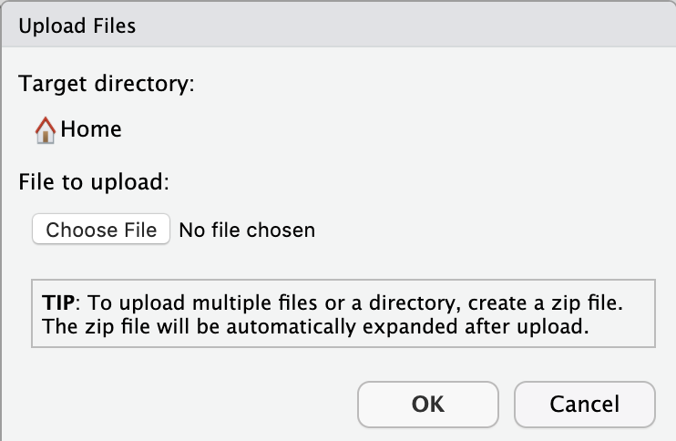
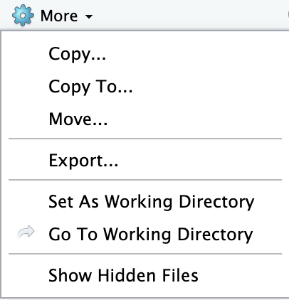
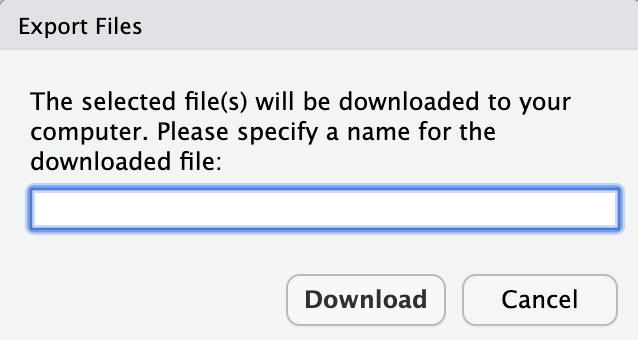
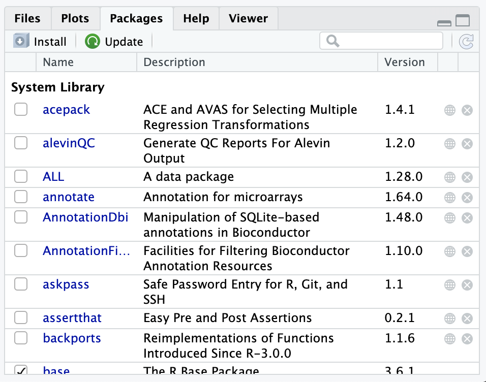
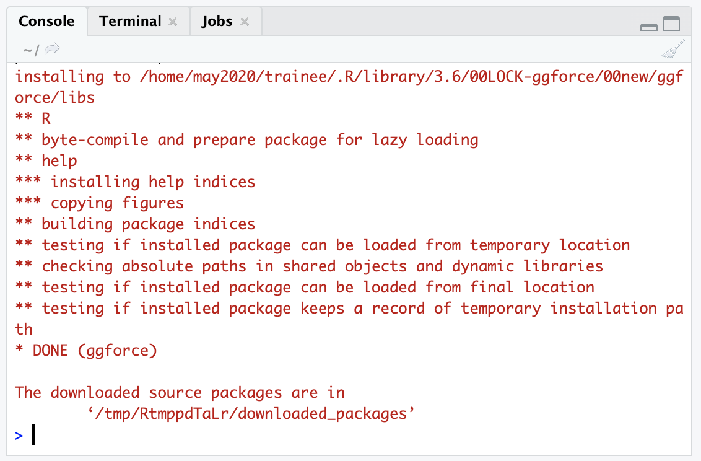

The goal of our workshop is to equip you to do initial analyses with your own data!
This guide will take you through how to get your data onto our RStudio server so you can begin analyzing your own data.

**Table of contents**

* TOC goes here
{:toc}

## Things to know before uploading your data

- If you are uploading data from human patient sequencing samples, **please be sure that you are doing so in a manner that is consistent with participant consent and your institution’s rules**. The only data that is permissible for upload to our server is that which has been summarized to non-sequence level and has no personally identifiable information (PII) and no protected health information (PHI).

- Initially, we have equipped you with **50 GB of space** (if the data you would like to upload is larger than this, please consult one of the Data Lab team members through Slack for assistance).

- If you don't have your own data that you are looking to analyze, but would like real transcriptomic datasets to practice with, see the [Workshop Resources page](workshop-resources.md) and/or ask a Data Lab team member for recommendations.

- You will have access to our RStudio Server for 6 months.
We will email you with a reminder 6 months from now so you can make sure to remove any files from our RStudio Server that you may find useful before your access is revoked and the files are deleted.

- As always, please Slack one of the Data Lab team members if you need help with anything (that is what we are here for!).


## Loading data from a website

If you are retrieving your data from online, perhaps from a publicly available repository, we encourage you to use the terminal command `wget`.
`wget` works for `http://` `https://` and `ftp://` URLs.

**Step 1)** Go to the Terminal tab in your RStudio session.




**Step 2)** Copy over the [`wget` template script]({{site.repository_url}}/tree/main/additional-resources/template-scripts/wget-TEMPLATE.sh).

You'll find the `wget` template script in the `shared-data/template-scripts/` directory.
In the RStudio Server, you can click the check mark next to the file name, then go to `More` > and choose `Copy To` to make a copy with a new name somewhere convenient in your home directory.


**Step 3)** Set up your `wget` command in the template script we started for you.

The most simple `wget` command just needs the URL to pull the file from.

**Template:**
```
wget '<URL>'
```

The quote characters are not always required, but are a good practice in case the URL includes any strange characters that might cause problems.

**Specific example:**

Here's an example using `wget` to download a file from GEO:
```
wget 'https://ftp.ncbi.nlm.nih.gov/geo/series/GSE67nnn/GSE67851/suppl/GSE67851_RAW.tar'
```

By default, the file will be saved to the current directory and the file name it had from its origin (so with the above example `GSE67851_RAW.tar`).

Likely you will want to be more specific about where you are saving the file to and what you are calling it.
For that, we can use the `-O`, or `output` option with our `wget` command and specify a file path.

**Template:**
```
wget -O <FILE_PATH_TO_SAVE_TO> '<URL>'
```

**Specific example using the `-O` option:**

Here's another example where we will download that same array express file, but instead save it to a `data` folder and call it `some_array_data.tar`.
(Best to keep the file extension consistent to avoid troubles!)


Before we `wget` the files, we should create a `data/` folder to save to.
Most often we will want to create this in a project-specific directory.
[Keeping our files organized](https://www.thinkingondata.com/how-to-organize-data-science-projects/) can save us from some headaches in the future.


Let's assume that we have already created a directory inside the home directory called `training_project` to hold all of our project files.

```
# Navigate to the project directory
cd ~/training_project

# List the folders and files of our current directory
ls
```

If the `ls` command does not include `data` in its printed output, that means we will need to make a `data` folder with the `mkdir` command:

```
# Make a new data folder
mkdir data
```

You can double check that you successfully made a new folder by running `ls` again.
Now we are ready to `wget` data and copy it to our `data/` folder.

```
wget -O data/some_array_data.tar 'https://ftp.ncbi.nlm.nih.gov/geo/series/GSE67nnn/GSE67851/suppl/GSE67851_RAW.tar'
```

`-O` is one of many `wget` command options.
To see the complete list of `wget` options, use the command `wget -h` in Terminal.
You can also see some [more `wget` examples](https://www.tecmint.com/10-wget-command-examples-in-linux/).

As is recommended and also shown with this example, this dataset is compressed.
This means after you successfully `wget` the file, you will need to uncompress it.
To uncompress the contents of a `.tar` file to a particular directory, we will use the `-C` option.

**Template:**
```
tar -xf <FILE_TO_UNZIP> -C <DIRECTORY_TO_UNZIP_TO>
```

**Specific example:**

Here we will unzip the contents of `data/some_array_data.tar` to be saved to the directory `data/`.

```
tar -xf data/some_array_data.tar -C data/ 
```


[See this site](https://www.geeksforgeeks.org/linux-unix/tar-command-linux-examples/) for more on the `tar` command and other variations on its usage.

**If you have a password:**

You can still use `wget` to obtain data if you need credentials.
We don't recommend you put your password or any other credentials in the script or enter your password as part of a command, so you will want to type the following directly into the Terminal:

```
wget --user=<USERNAME> --ask-password '<URL>'
```
Using the `--ask-password` will prompt you to enter your password.


## Transferring small files (≲100 MB) to and from your computer

*These procedures will only reliably work for files smaller than roughly 100 MB.*

### Uploading small files to RStudio Server

If the data you want to use is stored locally on your computer, here's how we recommend uploading it to the RStudio Server.

**Step 1)** We recommend you compress your data folder into a single zip file.

For most operating systems, you can right-click on your data folder, and choose `Compress` to zip up your files.

* [See here](https://edu.gcfglobal.org/en/techsavvy/working-with-zip-files/1/#) for more detailed instructions on creating zip files in Windows and macOS.
* For reference, here's how you [compress files from the command line](https://coolestguidesontheplanet.com/how-to-compress-and-uncompress-files-and-folders-in-os-x-lion-10-7-using-terminal/).

**Step 2)** Once your data is compressed to a single file, log in to your RStudio server account (<https://rstudio.ccdatalab.org/>).

**Step 3)** Use the `Upload button` to choose your compressed data folder.

This button is in the lower right panel of your RStudio session:



A mini screen will pop up asking you to choose the file you want to upload:




Choose your compressed data file, and click `OK`.
This may take some time, particularly if you have a large dataset.

When the server is finished uploading your data, you should see your file in your `home` directory!
It will automatically be uncompressed.

### Downloading small files from the RStudio Server

You can export any files from the RStudio server that you'd like to save to your computer.

**Step 1)** Select the file(s) or folder(s) you would like to download
Check the box(es) to the left of the files or folder(s) in the **Files** pane.

**Step 2)** Use the Export button!

Click on the `More` button with a gear next to it in the lower right pane.



**Step 3)** Specify the name you would like the downloaded file to have.



**Step 4)** Find where the file downloaded.
Your computer may show the file in the bottom left of your browser window.
You are likely to find your files in your `Downloads` folder!

## Transferring large files (≳100MB) to and from your computer

To transfer larger files, you will need to use the [Rclone command line tool](https://rclone.org/) which is available on the RStudio Server.
Rclone can be run in the Terminal to transfer files to and from other cloud storage products, including but not limited to Dropbox, Box, Google Drive, and One Drive.

To use Rclone, you will first have to configure it with the command [`rclone config`](https://rclone.org/docs/), during which you will set up the connection to your third-party cloud storage service of choice. 
When you issue this command in Terminal, there will be a series of prompts for you to follow to get set up.

As part of this configuration process, you will select the type of cloud storage service you are using (e.g. Google Drive, Dropbox, etc.) and give it a name of your choosing to use with Rclone.
This name is referred to as your remote.
You will also be prompted with [`Use web browser to automatically authenticate rclone with remote?`](https://rclone.org/remote_setup/) for logging in to your remote (e.g., logging into Google Drive).
You will need to answer `N` to this question, since the RStudio Server we are working on cannot launch a web browser for you for logging in.
This means you also need to have Rclone installed on your local machine, from which you will log into your remote with the command `rclone authorize "name-of-service"` when prompted.
From a Mac you will run this command from a Terminal window, and from a PC you will run this command from the Windows Command Prompt. 
You can download and install Rclone from this site: <https://rclone.org/downloads/>.

Once you have configured Rclone, you can copy files to and from your remote.
For a full list of commands, please see [the Rclone documentation](https://rclone.org/commands/).
We provide a few examaples of common commands below, which asume we have connected to a remote we've named `mydrive`.

To list all files on your remote, use the following:

```sh
# Template for command
rclone ls <remote name>:path

# Example command: List all files on your remote
rclone ls mydrive:

# Example command: List files inside a specific path on your remote
rclone ls mydrive:folder/with/files/
```

To copy a file or folder from your remote to the RStudio Server, use the following:

```sh
# Template for command
rclone copy <remote name>:<path to file in remote> <path to save file to on RStudio Server> 

# Example command
rclone copy mydrive:folder/with/files/file_to_copy.txt ~/folder_with_my_files/
```

To copy a file or folder from to your remote from the RStudio Server, use the following:

```sh
# Template for command
rclone copy <file on RStudio Server> <remote name>:<path to send file to on your remote>

# Example command, which will place file_to_copy.txt at the top-level folder of your remote
rclone copy ~/folder_with_my_files/file_to_copy.txt mydrive:

# Or, copy to a specific folder in your remote
rclone copy ~/folder_with_my_files/file_to_copy.txt mydrive:folder/with/files/
```


## Installing packages

As you are working with your own data, you may find you want functionality from a package not yet installed to the RStudio server.
Here, we'll take you through some basics of how to install new packages.

### Finding what packages are installed

The RStudio Server has a list of packages installed for you already.
You can see this list of installed R packages by looking in the `Packages` tab:




Note that the checkmarks in the `Packages` tab indicate which packages are loaded currently in the environment.


Alternatively, you can run the `installed.packages()` command in the `Console` tab to see all installed packages.


### Installing a new package

Here we will take you through the most common R package installation steps and the most common roadblocks.
However, [*package dependencies*](http://r-pkgs.had.co.nz/description.html#dependencies), packages needing other packages to work (and specific versions of them!), can make this a [hairy process](https://en.wikipedia.org/wiki/Dependency_hell).
Because of this, we encourage you to reach out to one of the Data Lab team members for assistance if you encounter problems beyond the scope of this brief introduction!
#### Installing packages from CRAN with `install.packages()`

The Comprehensive R Archive Network or CRAN is a repository of packages that can all be installed with the `install.packages()` command.

In this example, we'll install `ggforce` which is a companion tool to `ggplot2` and is on CRAN.

We'll need to put quotes around `ggforce`!

```
install.packages("ggforce")
```

You should see output in the Console that shows some download bars, and finally some output that looks like this:




If your package installation is NOT successful, you'll see some sort of message like :

```
Warning in install.packages :
installation of package ‘ggforce’ had non-zero exit status
```

#### Installing Bioconductor packages

Bioconductor has a collection of bioinformatics-relevant packages but requires different steps for installation.
You have to use the [`BiocManager` package](https://cran.r-project.org/web/packages/BiocManager/vignettes/BiocManager.html) to install Bioconductor packages.

We have already installed `BiocManager` for you on the RStudio server, but on your computer you could install it by using `install.packages("BiocManager")` like we did in the previous section (it's on CRAN).

Since `BiocManager` is installed, (which you can check by using the [strategies in the above section](#finding-what-packages-are-installed)) then you can use the following command to install a package.
In this example, we'll install a package called `GenomicFeatures`.
```
BiocManager::install("GenomicFeatures")
```

You should get a similar successful installation message as in the previous section.

Or if it failed to install, it will give you a `non-zero exit status` message.

#### Installing packages from GitHub repositories

There may be times when you want to install a package that is not available from CRAN or Bioconductor, but instead _only_ exists within a given GitHub (or GitLab, etc.) repository.

We recommend that you use the [`remotes` package](https://remotes.r-lib.org/), which has already been installed for you in the RStudio Server and is available from CRAN for you to install to your computer (`install.packages("remotes")`).
For example, we can use `remotes` to install the [`emo` package](https://github.com/hadley/emo) from the `hadley` GitHub account:

```
remotes::install_github("hadley/emo")
```

### More resources on package installation strategies
- [Stack Overflow: Non-zero exit status](https://stackoverflow.com/questions/35666638/cant-access-user-library-in-r-non-zero-exit-status-warning)
- [Installing R packages](https://www.dataquest.io/blog/install-package-r/)
